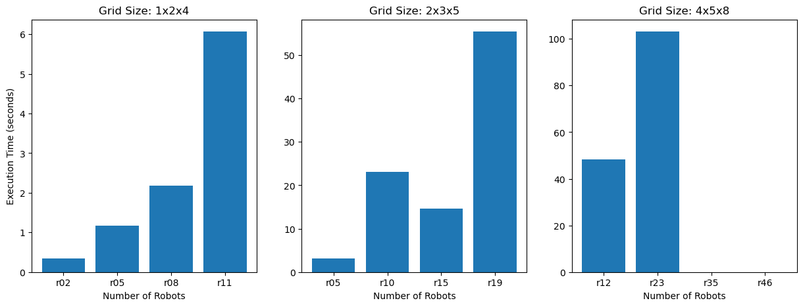

# Project: MAPF with pruning in ASP

```lua
%* authors *%
% Ben Kampmann, 803374, kampmann2@uni-potsdam.de
% Till Zemann, 808255, till.zemann@uni-potsdam.de
```

### How to run our solver

For [aspirilo](https://asprilo.github.io/) instances:
```bash
clingo solver.lp convert-m-to-mif.lp <instance.lp> 0
```

For our own MIF-format instances:
```bash
clingo solver.lp <instance.lp> 0
```

### Results

We report results for one randomly drawn instance per aspirilo configuration (grid size and number of robots).
We only use instances from the "M" (movement-only) domain, which corresponds to the MAPF-problem.



The plot doesn't show an execution time for the last two instances on large grids (4x5x8), as we set a maximum Makespan of 50 in our solver and no solution could be found with a Makespan smaller or equal to 50.

### Appendix

The randomly drawn instances used for the evaluation were:

```txt
x11_y6_n66_r2_s16_ps1_pr16_u16_o2_N013.lp
x11_y6_n66_r5_s16_ps1_pr16_u16_o5_N003.lp
x11_y6_n66_r8_s16_ps1_pr16_u16_o8_N013.lp
x11_y6_n66_r11_s16_ps1_pr16_u16_o11_N022.lp
x19_y9_n171_r5_s60_ps3_pr60_u60_o5_N012.lp
x19_y9_n171_r10_s60_ps3_pr60_u60_o10_N019.lp
x19_y9_n171_r15_s60_ps3_pr60_u60_o15_N017.lp
x19_y9_n171_r19_s60_ps3_pr60_u60_o19_N011.lp
x46_y15_n690_r12_s320_ps10_pr320_u320_o12_N012.lp
x46_y15_n690_r23_s320_ps10_pr320_u320_o23_N007.lp
x46_y15_n690_r35_s320_ps10_pr320_u320_o35_N019.lp
x46_y15_n690_r46_s320_ps10_pr320_u320_o46_N005.lp
```

The instances correspond to the following aspirilo configurations (in the same order):

```py
[['1x2x4', 'r02'],
 ['1x2x4', 'r05'],
 ['1x2x4', 'r08'],
 ['1x2x4', 'r11'],
 ['2x3x5', 'r05'],
 ['2x3x5', 'r10'],
 ['2x3x5', 'r15'],
 ['2x3x5', 'r19'],
 ['4x5x8', 'r12'],
 ['4x5x8', 'r23'],
 ['4x5x8', 'r35'],
 ['4x5x8', 'r46']]
```
